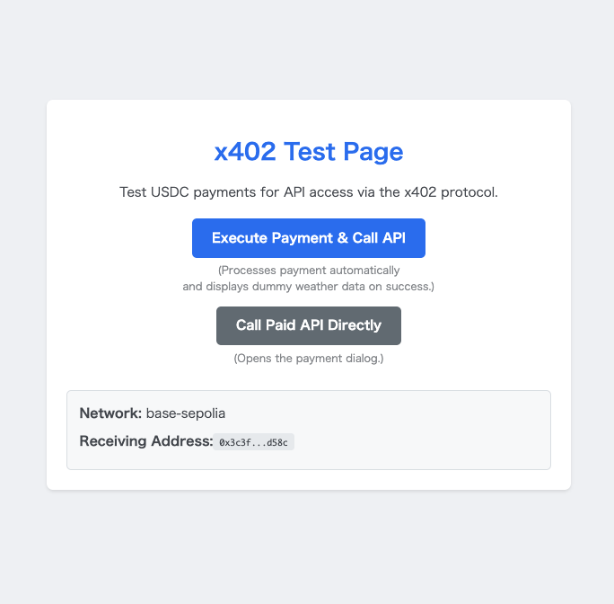

# Hono x402 Seller & Buyer Test Environment

[](https://hono.dev/)

This is a self-contained test environment built with [Hono](https://hono.dev/) to demonstrate and experiment with the [x402 Protocol](https://x402.org/).
This project helps you test USDC payments on the Base, Base Sepolia, and Solana Devnet networks, utilizing the facilitator from [payai.network](https://payai.network/).



The project simulates both a "seller" and a "buyer" within a single server instance:

- **Seller**: A paid API endpoint (`/api/weather`) protected by the `x402-hono` middleware.
- **Buyer**: A client API endpoint (`/client/call-weather`) that uses `x402-fetch` to automatically handle the payment flow and access the paid content.
- **Facilitator**: Utilizes the service from [payai.network](https://payai.network/) to provide payment details to the client.
  > **Tip:** This project also works with a self-hostable facilitator: [snc2work/x402-facilitator-hono](https://github.com/snc2work/x402-facilitator-hono). Try it if you want to learn how the facilitator side works. The "Tips for Buyers" section in that repository may also be helpful for Solana mainnet configurations.

It includes a simple web interface to easily test both scenarios.

## Prerequisites

- [Node.js](https://nodejs.org/) (v18 or later recommended)
- [Yarn](https://yarnpkg.com/)
- A test wallet with a private key and some testnet funds (e.g., Base Sepolia ETH/USDC).

## Getting Started

Follow these steps to get the project running on your local machine.

### 1. Clone the repository

```bash
git clone https://github.com/snc2work/x402-hono-seller-buyer-example.git
cd x402-hono-seller-buyer-example
```

### 2. Install dependencies

```bash
yarn install
```

### 3. Set up environment variables

Copy the sample environment file and fill in your details.

```bash
cp .env.sample .env
```

Now, open the `.env` file and set the following variables:

- `PAY_TO_ADDRESS`: The wallet address that will receive payments.
- `NETWORK`: The blockchain network to use (e.g., `base-sepolia`).
- `PRIVATE_KEY`: The private key of the test/burner wallet that will make payments. **Do not use a wallet with real funds!**

### 4. Run the server

```bash
yarn dev
```

The server will start on `http://localhost:8787`.

## Usage

1.  Open your web browser and navigate to `http://localhost:8787`.

2.  You will see two buttons on the test page:

    - **Execute Payment & Call API**: This calls the `/client/call-weather` endpoint. It will automatically perform the blockchain payment and, upon success, display the fetched **dummy** weather data in a new tab.

    - **Call Paid API Directly**: This button calls the `/api/weather` endpoint directly. Since no payment has been made, this will trigger the x402 payment UI, prompting you to connect a wallet.

## Environment Variables

| Variable              | Description                                                                        | Example                           |
| --------------------- | ---------------------------------------------------------------------------------- | --------------------------------- |
| `PAY_TO_ADDRESS`      | The address to receive payments.                                                   | `0xAbc...` or `5xYz...`           |
| `NETWORK`             | The blockchain network to use. Supported: `base-sepolia`, `base`, `solana-devnet`. | `base-sepolia`                    |
| `FACILITATOR_URL`     | The x402 facilitator service URL.                                                  | `https://facilitator.http402.xyz` |
| `PRIVATE_KEY`         | Private key of a **burner wallet** for making payments.                            | `0x123...` or a Base58 string     |
| `RESOURCE_SERVER_URL` | The base URL of this server for internal calls.                                    | `http://localhost:8787`           |
| `ENDPOINT_PATH`       | The path of the paid API endpoint.                                                 | `/api/weather`                    |

## Version Information

This project was built and tested with the following library versions:

- `x402-fetch`: `^0.7.0`
- `x402-hono`: `^0.7.1`

Please be aware that future updates to these libraries may introduce breaking changes.

## License

This project is licensed under the MIT License.
